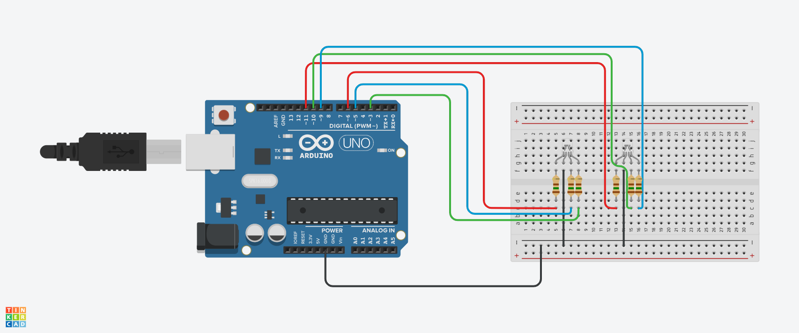

## Controle de Dois LEDs RGB.

Este código foi criado no TinkerCard na linguagem C++, com o intuito de deixar o ambiente mais amigavel com suas cores diferentes.

Este código demonstra como usar a plataforma Arduino para criar um controle simples e dinâmico de LEDs RGB. 
A geração de cores aleatórias proporciona um efeito visual interessante e é uma excelente base para projetos mais complexos de iluminação e decoração.
As possibilidades de expansão incluem a adição de sensores, botões ou outros componentes para interação com o usuário.

## Introdução

O código apresentado é um exemplo de controle de dois LEDs RGB (vermelho, verde e azul) utilizando a plataforma Arduino.
Cada LED RGB é controlado de forma independente, permitindo a geração de uma ampla variedade de cores ao manipular a intensidade das componentes de luz.
Este projeto é ideal para demonstrações de efeitos de iluminação, decorações interativas e projetos de arte visual.

## Componentes Utilizados.

- 1 Arduino Uno.
- 1 Protoboard.
- 9 Jumpers Macho-Macho.
- 6 Resistores De 150 Ohms.
- 2 Leds RGBD.

## Estrutura do Arduino.

## Descrição do Código.

Definição de Variáveis

int R = 6;   -- Porta para o LED vermelho do primeiro LED RGB
int G = 3;   -- Porta para o LED verde do primeiro LED RGB
int B = 5;   -- Porta para o LED azul do primeiro LED RGB

int V = 11;  -- Porta para o LED vermelho do segundo LED RGB
int VE = 10; -- Porta para o LED verde do segundo LED RGB
int A = 9;   -- Porta para o LED azul do segundo LED RGB

As variáveis são definidas para os pinos digitais do Arduino onde os LEDs RGB estão conectados.
Cada LED tem um pino para cada cor (vermelho, verde e azul).

## Função setup();

void setup()
{
  -- Configuração dos pinos como saídas para o primeiro LED RGB
  pinMode(R, OUTPUT);
  pinMode(G, OUTPUT);
  pinMode(B, OUTPUT);
  
  -- Configuração dos pinos como saídas para o segundo LED RGB
  pinMode(V, OUTPUT);
  pinMode(VE, OUTPUT);
  pinMode(A, OUTPUT);
}

A função setup() é chamada uma vez quando o programa é iniciado.
Nela, os pinos dos LEDs são configurados como saídas, permitindo que o Arduino envie sinais de controle para acender as cores dos LEDs.

## Função loop();

void loop()
{
  -- Geração de números aleatórios para o primeiro LED RGB
  int v1 = random(0, 255);  -- Valor aleatório para o vermelho do primeiro LED (0 a 255)
  int v2 = random(0, 255);  -- Valor aleatório para o verde do primeiro LED (0 a 255)
  int v3 = random(0, 255);  -- Valor aleatório para o azul do primeiro LED (0 a 255)
  
  -- Geração de números aleatórios para o segundo LED RGB
  int v4 = random(0, 255);  -- Valor aleatório para o vermelho do segundo LED (0 a 255)
  int v5 = random(0, 255);  -- Valor aleatório para o verde do segundo LED (0 a 255)
  int v6 = random(0, 255);  -- Valor aleatório para o azul do segundo LED (0 a 255)
  
  -- Aplicação dos valores aleatórios para o primeiro LED RGB
  analogWrite(R, v1); -- Ajusta a intensidade do vermelho do primeiro LED (0 a 255)
  analogWrite(G, v2); -- Ajusta a intensidade do verde do primeiro LED (0 a 255)
  analogWrite(B, v3); -- Ajusta a intensidade do azul do primeiro LED (0 a 255)
  
  -- Aplicação dos valores aleatórios para o segundo LED RGB
  analogWrite(V, v4);  -- Ajusta a intensidade do vermelho do segundo LED (0 a 255)
  analogWrite(VE, v5); -- Ajusta a intensidade do verde do segundo LED (0 a 255)
  analogWrite(A, v6);  -- Ajusta a intensidade do azul do segundo LED (0 a 255)
  
  -- Pausa de 50 milissegundos antes de atualizar os valores novamente
  delay(50); 
}

A função loop() é chamada repetidamente enquanto o Arduino estiver ligado. Dentro dela:

- 1 Geração de Valores Aleatórios: A função random(0, 255) gera um valor aleatório entre 0 e 255 para cada cor de ambos os LEDs, 
representando a intensidade da luz que será emitida.

- 2 Controle dos LEDs: Os valores gerados são aplicados a cada cor dos LEDs usando analogWrite(), que ajusta a intensidade das cores correspondentes.

- 3 Atualização Contínua: Após aplicar as intensidades, há uma pausa de 50 milissegundos (delay(50)) antes que novos valores sejam gerados, 
criando um efeito dinâmico e vibrante.

## Código.

-- C++ code
-- Controle de dois LEDs RGB, cada um com pinos separados para as cores vermelha, verde e azul

int R = 6;   -- Porta para o LED vermelho do primeiro LED RGB
int G = 3;   -- Porta para o LED verde do primeiro LED RGB
int B = 5;   -- Porta para o LED azul do primeiro LED RGB

int V = 11;  -- Porta para o LED vermelho do segundo LED RGB
int VE = 10; -- Porta para o LED verde do segundo LED RGB
int A = 9;   -- Porta para o LED azul do segundo LED RGB

void setup()
{
  -- Configuração dos pinos como saídas para o primeiro LED RGB
  pinMode(R, OUTPUT);
  pinMode(G, OUTPUT);
  pinMode(B, OUTPUT);
  
  -- Configuração dos pinos como saídas para o segundo LED RGB
  pinMode(V, OUTPUT);
  pinMode(VE, OUTPUT);
  pinMode(A, OUTPUT);
}

void loop()
{
  -- Geração de números aleatórios para o primeiro LED RGB
  -- Cada variável representa um valor de intensidade para as cores (vermelho, verde, azul)
  int v1 = random(0, 255);  -- Valor aleatório para o vermelho do primeiro LED (0 a 255)
  int v2 = random(0, 255);  -- Valor aleatório para o verde do primeiro LED (0 a 255)
  int v3 = random(0, 255);  -- Valor aleatório para o azul do primeiro LED (0 a 255)
  
  -- Geração de números aleatórios para o segundo LED RGB
  -- Cada variável representa um valor de intensidade para as cores (vermelho, verde, azul)
  int v4 = random(0, 255);  -- Valor aleatório para o vermelho do segundo LED (0 a 255)
  int v5 = random(0, 255);  -- Valor aleatório para o verde do segundo LED (0 a 255)
  int v6 = random(0, 255);  -- Valor aleatório para o azul do segundo LED (0 a 255)
  
  -- Aplicação dos valores aleatórios para o primeiro LED RGB
  analogWrite(R, v1); -- Ajusta a intensidade do vermelho do primeiro LED (0 a 255)
  analogWrite(G, v2); -- Ajusta a intensidade do verde do primeiro LED (0 a 255)
  analogWrite(B, v3); -- Ajusta a intensidade do azul do primeiro LED (0 a 255)
  
  -- Aplicação dos valores aleatórios para o segundo LED RGB
  analogWrite(V, v4);  -- Ajusta a intensidade do vermelho do segundo LED (0 a 255)
  analogWrite(VE, v5); -- Ajusta a intensidade do verde do segundo LED (0 a 255)
  analogWrite(A, v6);  -- Ajusta a intensidade do azul do segundo LED (0 a 255)
  
  -- Pausa de 50 milissegundos antes de atualizar os valores novamente
  delay(50); 
}

