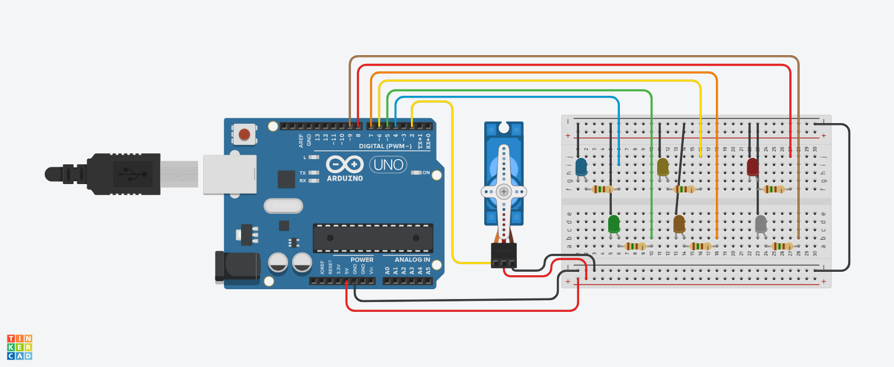

## Controle de Servo Motor e LEDs Coloridos.

Este código  feito no TinkerCard na linguagem C++, com a função de controlar um servo motor e uma sequência de LEDs coloridos 
(azul, verde, amarelo, laranja, vermelho e branco). O servo motor é girado para ângulos específicos,
e cada posição angular aciona o acendimento de um LED correspondente. Após atingir a posição final (180 graus),
o servo volta para os ângulos anteriores, acendendo os LEDs na ordem inversa.

## Observações.

Durante a execução desta atividade, fiz pequenas modificações da atividade pedida, como aumentar  LEDs para refletir seus núcleos.
Essas mudanças foram realizadas por curiosidade, deixando o código mais claro e organizado, além de facilitar testes futuros, sem alterar o comportamento

## Componentes Utilizados.

- 1 Microcontrolador (ex.: Arduino Uno):
- 1 Servomotor :
- 6 LEDs coloridos(Azul, Verde, Amarelo, Laranja, Vermelho e Branco).
- 6 Resistores de 150 Ohms.
- 3 Jumpers Macho-Fémea.
- 15 Jumpers Macho-Macho.
- Protoboard.

## Imagem do Arduino com motor com Leds.

## Pinos de Conexão

Servo motor : Conectado ao pino 2 do microcontrolador.

LEDs :

- 1 Azul (45°): Pino 4
- 1 Verde (90°): Pino 5
- 1 Amarelo (135°): Pino 6
- 1 Laranja (145°): Piño 7
- 1 Vermelho (175°): Pino 8
- 1 Branco (180°): Pino 9

## Estrutura do Código.

#  Bibliotecas

#include <Servo.h>

Uma biblioteca Servo.h utilizada para controlar o movimento do servo motor. 
Ela permite mover o servo para posições angulares específicas, utilizando o método write().

## Declaração de Variáveis.

Servo objetoservo;

Servo objetoservo : Cria um objeto da classe Servo. Este objeto será usado para controlar o servo motor.

int servo = 2;      -- PINO DO SERVO
int ledAzul = 4;    -- LED AZUL (45°)
int ledVerde = 5;   -- LED VERDE (90°)
int ledAmarelo = 6; -- LED AMARELO (135°)
int ledLaranja = 7; -- LED LARANJA (145°)
int ledVermelho = 8;-- LED VERMELHO (175°)
int ledBranco = 9;  -- LED BRANCO (180°)

Variáveis ​​do tipo intsão utilizadas para armazenar os números dos pinos do microcontrolador conectado ao servo motor e aos LEDs. 
As variáveis ​​são nomeadas de acordo com a cor do LED para facilitar a compreensão.

## Funçãosetup();

void setup() {
  objetoservo.attach(servo);
  pinMode(ledAzul, OUTPUT);
  pinMode(ledVerde, OUTPUT);
  pinMode(ledAmarelo, OUTPUT);
  pinMode(ledLaranja, OUTPUT);
  pinMode(ledVermelho, OUTPUT);
  pinMode(ledBranco, OUTPUT);
}

A função setup()é executada apenas uma vez quando o microcontrolador é ligado ou reiniciado. Nesta função:

## Inicialização do Servo.

objetoservo.attach(servo):

O método attach()é usado para ligar o servo ao pino designado (pino 2).
Isso permite que o objeto objetoservocontrole o movimento do servo motor.

## Configuração dos Pinos de Saída para LEDs .

pinMode(pino, OUTPUT): Cada pino associado aos LEDs (4, 5, 6, 7, 8 e 9) 
é configurado como saída para que o microcontrolador controle possa se o LED estiver ligado ( HIGH) ou desligado ( LOW).

##  Funçãoloop();

A função loop()é onde ocorre o comportamento repetitivo do sistema.
A cada iteração, o servo motor é movido para diferentes posições angulares, e os LEDs correspondentes são acesos e apagados.

# Movimentação do Servo para Frente.

A primeira parte da função move o servo em incrementos de ângulo e acende o LED correspondente.

objetoservo.write(30);
digitalWrite(ledAzul, HIGH);
delay(1000);
digitalWrite(ledAzul, LOW);

## Movimentação do Servo :

objetoservo.write(30): O método write()move o servo para o ângulo especificado.
Aqui, o servo é movido para aproximadamente 45° (a escrita de 30graus no servo resulta em um movimento aproximado de 45° dependendo do ajuste do servo).

## Controle do LED :

digitalWrite(ledAzul, HIGH): Acende o LED conectado ao pino 4 (LED azul) para enviar um sinal HIGH (5V).

delay(1000): A função delay()pausa a execução do código por 1000 milissegundos (1 segundo), mantendo o LED aceso por esse tempo.

digitalWrite(ledAzul, LOW): Após 1 segundo, o LED é apagado enviando um sinal LOW (0V) ao pino correspondente.

Este processo se repete para os outros LEDs e ângulos:

90° -> LED verde (pino 5)
135° -> LED amarelo (pino 6)
145° -> LED laranja (pino 7)
175° -> LED vermelho (pino 8)
180° -> LED branco (pino 9)

## Movimentação do Servo para Trás.

Após o servo motor atingir a posição final de 180°, ele retorna pelos ângulos anteriores, acendendo os LEDs correspondentes na ordem inversa.

objetoservo.write(175);
digitalWrite(ledVermelho, HIGH);
delay(500);
digitalWrite(ledVermelho, LOW);

O tempo de espera ( delay) é limitado para 500 ms durante o retorno.

## Retorno à Posição Inicial.

Por fim, o servo retorna à posição 0° (posição inicial) e todos os LEDs permanecem apagados:

objetoservo.write(0);
delay(500);

## Lógica do Código.

O código segue uma lógica de "ida e volta":

Ida : O servo se move de 45° até 180°, acendendo os LEDs na ordem.
Volta : O servo sai do 180° para a posição 0° de onde deu início.

## Código.

-- BIBLIOTECA DO SERVO MOTOR
#include <Servo.h>

-- CRIANDO OBJETO DO TIPO SERVO MOTOR
Servo objetoservo;

-- VARIÁVEIS PARA SALVAR AS PORTAS DO SERVO E DOS LEDs POR COR
int servo = 2;      -- PINO DO SERVO
int ledAzul = 4;    -- LED AZUL (45°)
int ledVerde = 5;   -- LED VERDE (90°)
int ledAmarelo = 6; -- LED AMARELO (135°)
int ledLaranja = 7; -- LED LARANJA (145°)
int ledVermelho = 8; -- LED VERMELHO (175°)
int ledBranco = 9;  -- LED BRANCO (180°)

void setup() {
  -- INICIALIZAÇÃO DO SERVO
  objetoservo.attach(servo); 
  
  -- DEFINIR OS PINOS DOS LEDs COMO SAÍDA
  pinMode(ledAzul, OUTPUT);
  pinMode(ledVerde, OUTPUT);
  pinMode(ledAmarelo, OUTPUT);
  pinMode(ledLaranja, OUTPUT);
  pinMode(ledVermelho, OUTPUT);
  pinMode(ledBranco, OUTPUT);
}

void loop() {
  -- ROTACIONA O SERVO PARA 45° E ACENDE O LED AZUL
  objetoservo.write(30);
  digitalWrite(ledAzul, HIGH);  -- ACENDE O LED AZUL
  delay(1000);
  digitalWrite(ledAzul, LOW);   -- APAGA O LED AZUL

  -- ROTACIONA O SERVO PARA 90° E ACENDE O LED VERDE
  objetoservo.write(60);
  digitalWrite(ledVerde, HIGH);  -- ACENDE O LED VERDE
  delay(1000);
  digitalWrite(ledVerde, LOW);   -- APAGA O LED VERDE

  -- ROTACIONA O SERVO PARA 135° E ACENDE O LED AMARELO
  objetoservo.write(90);
  digitalWrite(ledAmarelo, HIGH);  -- ACENDE O LED AMARELO
  delay(1000);
  digitalWrite(ledAmarelo, LOW);   -- APAGA O LED AMARELO

  -- ROTACIONA O SERVO PARA 145° E ACENDE O LED LARANJA
  objetoservo.write(145);
  digitalWrite(ledLaranja, HIGH);  -- ACENDE O LED LARANJA
  delay(1000);
  digitalWrite(ledLaranja, LOW);   -- APAGA O LED LARANJA

  -- ROTACIONA O SERVO PARA 175° E ACENDE O LED VERMELHO
  objetoservo.write(175);
  digitalWrite(ledVermelho, HIGH);  -- ACENDE O LED VERMELHO
  delay(1000);
  digitalWrite(ledVermelho, LOW);   -- APAGA O LED VERMELHO

  -- ROTACIONA O SERVO PARA 180° E ACENDE O LED BRANCO
  objetoservo.write(180);
  digitalWrite(ledBranco, HIGH);  -- ACENDE O LED BRANCO
  delay(1000);
  digitalWrite(ledBranco, LOW);   -- APAGA O LED BRANCO

  -- RETORNA PELOS ÂNGULOS ANTERIORES E ACENDE OS LEDs

  -- VOLTA PARA 175° E ACENDE O LED VERMELHO
  objetoservo.write(175);
  digitalWrite(ledVermelho, HIGH);  -- ACENDE O LED VERMELHO
  delay(500);
  digitalWrite(ledVermelho, LOW);   -- APAGA O LED VERMELHO

  -- VOLTA PARA 145° E ACENDE O LED LARANJA
  objetoservo.write(145);
  digitalWrite(ledLaranja, HIGH);  -- ACENDE O LED LARANJA
  delay(500);
  digitalWrite(ledLaranja, LOW);  -- APAGA O LED LARANJA

  -- VOLTA PARA 135° E ACENDE O LED AMARELO
  objetoservo.write(135);
  digitalWrite(ledAmarelo, HIGH);  -- ACENDE O LED AMARELO
  delay(500);
  digitalWrite(ledAmarelo, LOW);   -- APAGA O LED AMARELO

  -- VOLTA PARA 90° E ACENDE O LED VERDE
  objetoservo.write(90);
  digitalWrite(ledVerde, HIGH);  -- ACENDE O LED VERDE
  delay(500);
  digitalWrite(ledVerde, LOW);   -- APAGA O LED VERDE

  -- VOLTA PARA 45° E ACENDE O LED AZUL
  objetoservo.write(45);
  digitalWrite(ledAzul, HIGH);  -- ACENDE O LED AZUL
  delay(500);
  digitalWrite(ledAzul, LOW);   -- APAGA O LED AZUL

   -- VOLTA PARA 0° (POSIÇÃO INICIAL) E TODOS OS LEDs FICAM APAGADOS
  objetoservo.write(0);
  delay(500);
}

