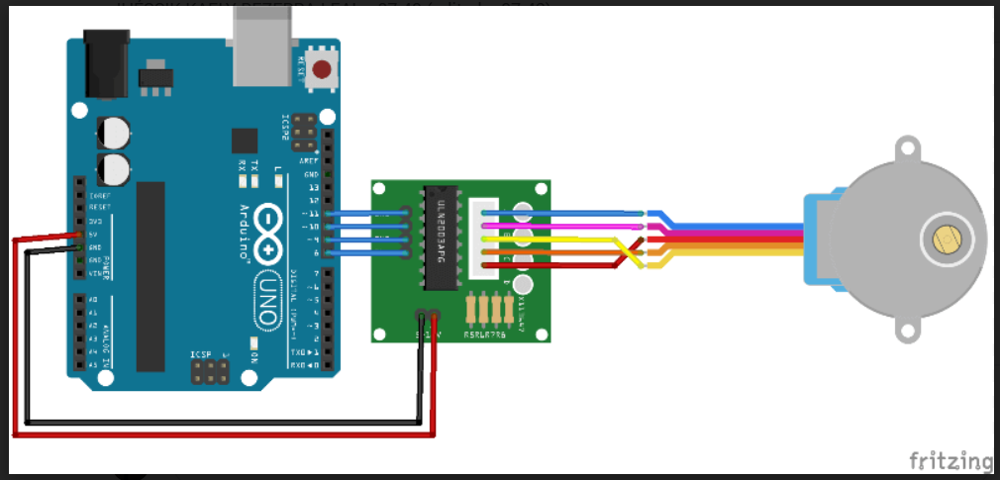

##  Controle de Motor de Passo Utilizando a Biblioteca AccelStepper.

Este projeto foi desenvolvido no Arduino IDE, com o intuito de o motor de Passos ficar girando a 360° e volta a 0° isso em loop,
ele tem foça o suficiente de girar barras de ferros como abrir portas por exemplo.

## Componentes Utilizados.

- 1 Arduino Uno.
- 1 Motor de passos.
- 6 Jumpers Macho-Fémea.

## Imagem da estrutura.

## Dependências do Sistema:

# IDE Arduino:

# AceleradorStepper.h:

# MultiStepper.h: Incluindo

## Declarações e Definições:

#include <AccelStepper.h>

#include <MultiStepper.h>

# AccelStepper.h : Biblioteca

MultiStepper.h:

# define Voltas 1024

# Voltas 

AccelStepper motor (AccelStepper::FULL4WIRE,8,10,9,11);

motor : Objeto da classe AccelStepper configurado para operar com motores de passo de 4 fios,
no modo FULL4WIRE. Os pinos utilizados para o controle do motor são os pinos 8, 10, 9 e 11.

## Função setup():

A função setup()é responsável pela configuração inicial do motor, como definir a velocidade máxima e a aceleração.

void setup() {
    motor.setMaxSpeed(1000);
    motor.setAcceleration(100);
    motor.moveTo(Voltas);
}

motor.setMaxSpeed(1000) : Define a velocidade máxima do motor de passo. No exemplo, está configurado para 1000 passos por segundo.

motor.setAcceleration(100) : Define a hidratação máxima do motor. O valor de 100 define uma rampa de aceleração para evitar movimentos bruscos.

motor.moveTo(Voltas) : Configura o motor para se mover até a posição definida pela constante Voltas, que corresponde a uma rotação completa (360°).

## Função loop():

A função loop()contém a lógica de controle contínuo do motor. Verifique se o motor já atingiu a posição desejada e, se sim, inverta a direção.

void loop() {
    if (motor.distanceToGo() == 0) {
        motor.moveTo(-motor.currentPosition());
    }
    motor.run();
}

motor.distanceToGo() : Retorna a distância restante (em passos) até a posição alvo. Quando essa distância é zero, significa que o motor atingiu a posição definida.
motor.moveTo(-motor.currentPosition()) : Quando o motor atinge a posição alvo, este comando inverte a direção de movimento, fazendo com que ele gire para a posição oposta.
motor.run() : Função que executa o movimento do motor. Deve ser chamada continuamente dentro loop()para garantir que o motor se mova.

# O motor de passo é configurado para se mover em uma direção até completar 1024 passos (uma volta completa de 360°).

# Quando o motor atinge a posição alvo, ele automaticamente inverte a direção e retorna à posição inicial.

# O motor continua alternando entre as duas regulamentações indefinidamente, controlado pelas funções moveTo()e run().

## Código.

#include <AccelStepper.h>
#include <MultiStepper.h>

  -- incluir a biblioteca

 
  -- 360° = 1024
  -- 180° = 512
  -- 90° = 256
  -- 60° = 170
  -- 45° = 128

  --  Variavel para controlar as voltas motor 

  #define Voltas 1024
  -- Criando objeto para controlar o motor
  AccelStepper motor (AccelStepper::FULL4WIRE,8,10,9,11);

  void setup(){
  -- denifir a velocidade maxima do motor
  motor.setMaxSpeed(1000);
  --  definir aceleração maxima desse motor

  motor.setAcceleration(100);
 motor.moveTo(Voltas);
  -- girar a sentido contrario
}

void loop(){
  -- habilitar as portas de controle do motor no arduino
 
 
  if (motor.distanceToGo() ==0){
  -- Executa o comando para dar uma volta no sentido contrario
   motor.moveTo(-motor.currentPosition());
  
}
 motor.run();
  -- fazer o motor se movimentar

}
