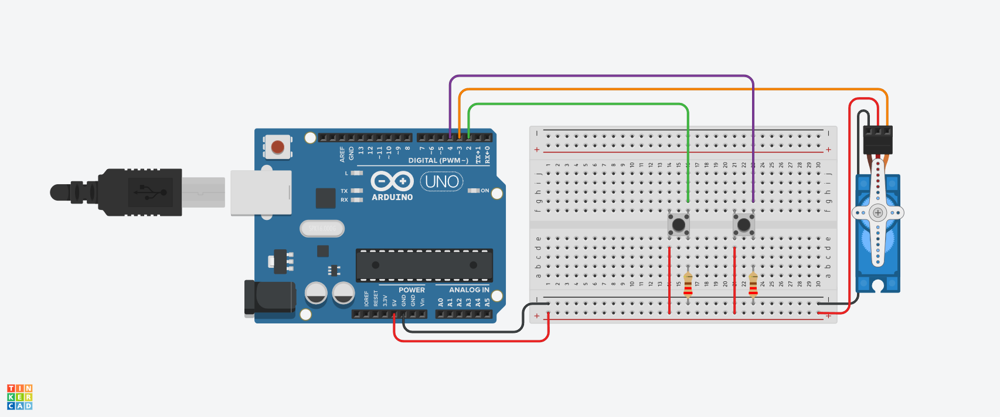

## Motor com Arduino.

Este código controla o comportamento de um servo motor e dois LEDs com base na leitura de distância fornecida por um sensor ultrassônico. 
Ele faz o servo motor girar progressivamente ao detectar um obstáculo a menos de 50 cm de distância e acende um LED vermelho. 
Quando a distância está livre (mais de 50 cm), o LED verde acende e o servo para de se mover.
Este código foi Criado no tinkercard na linguagem C++, sendo testado em um Arduino físico para testes .

## Introdução

Este código foi desenvolvido para controlar uma "cabeça de robô" equipada com um servo motor, dois LEDs e um sensor ultrassônico. 
O objetivo do projeto é detectar obstáculos à frente do robô, acender um LED vermelho ao encontrar um objeto a uma distância menor que 50 cm,
e girar a "cabeça" progressivamente para o outro lado. Quando não há obstáculos à frente (distância maior ou igual a 50 cm), o LED verde acende,
e o servo motor retorna à posição inicial.

## Componentes Utilizados.

- 1 Arduiino Uno.
- 1 Protoboard.
- 1 Sensor de Distãncia Ultrassônico.
- 1 Micro Servo.
- 1 Led (Vermelho, Verde).
- 2 resistor de 150 Ohms.
- 4 Jumpers Macho_Fémea.
- 9 Jumpers Macho_Macho.

##  Biblioteca Utilizada.

Servo.h: Esta biblioteca permite o controle fácil de servo motores. 
Ela fornece funções para definir a posição do motor e realizar movimentos precisos.

##  Algoritmos Utilizados

Leitura de Distância: Um algoritmo que envia um pulso pelo sensor ultrassônico e calcula a distância com base no tempo que o pulso leva para retornar.

Controle de LEDs: Lógica para acender ou apagar os LEDs dependendo da presença de obstáculos.

Controle do Servo Motor: Algoritmo que ajusta a posição do servo motor com base na distância medida,
permitindo que o robô gire a "cabeça" em resposta à detecção de obstáculos.

## Criação do Objeto Servo Motor.

Servo objetoservo; -- CRIAÇÃO DO OBJETO SERVO MOTOR

##  Definição dos Pinos.

int led1 = 5;       -- LED VERMELHO
int servo = 2;      -- PINO DO SERVO MOTOR
int posicao = 0;    -- POSIÇÃO INICIAL DO SERVO
int led2 = 6;       -- LED VERDE

## Descrição:

led1: Define o pino digital 5 como saída para o LED vermelho.

servo: Define o pino digital 2 para controle do servo motor.

posicao: Variável que armazena a posição atual do servo motor, inicialmente definida como 0 graus.

led2: Define o pino digital 6 como saída para o LED verde.

## Função de Distância.

long distancia(int trigger, int echo) {
  -- CONFIGURA O TRIGGER COMO PORTA DE SAÍDA
  pinMode(trigger, OUTPUT);
  digitalWrite(trigger, LOW); -- GARANTE QUE O TRIGGER ESTEJA BAIXO
  delay(5); -- ESPERA 5 MILISSEGUNDOS
  -- MANDANDO SINAL PARA O SENSOR
  digitalWrite(trigger, HIGH); -- ENVIA UM PULSO ALTO
  digitalWrite(trigger, LOW);  -- RETORNA O PULSO PARA BAIXO
  -- CONFIGURA O ECHO COMO PORTA DE ENTRADA
  pinMode(echo, INPUT);
  -- RETORNA A DURAÇÃO DO PULSO RECEBIDO
  return pulseIn(echo, HIGH); -- LÊ O TEMPO QUE O ECHO DEMORA PARA RECEBER O SINAL
}

## Descrição: 

Esta função calcula a distância até um objeto usando um sensor ultrassônico.
 Parâmetros:
 trigger: 
O pino de saída usado para enviar o pulso.
 echo: 
O pino de entrada usado para receber o pulso refletido.
 Processo:
Configura o pino trigger como saída.
Envia um pulso de som e depois o desliga.
Configura o pino echo como entrada.
Retorna a duração do pulso recebido, que é usado para calcular a distância.

##  Função de Configuração (setup)

void setup() {
  -- CONFIGURAÇÃO DOS LEDs
  pinMode(led1, OUTPUT);   -- DEFINE O PINO DO LED VERMELHO COMO SAÍDA
  pinMode(led2, OUTPUT);   -- DEFINE O PINO DO LED VERDE COMO SAÍDA
  
  -- INICIA O SERVO MOTOR NO PINO DEFINIDO
  objetoservo.attach(servo);
  
  -- AJUSTA A POSIÇÃO INICIAL DO SERVO PARA 0 GRAUS
  objetoservo.write(posicao);
}

## Descrição:

A função setup é chamada uma vez no início do programa. Ela configura os pinos e inicializa o servo motor.
Define os pinos dos LEDs como saídas.
Anexa o servo motor ao pino definido.
Define a posição inicial do servo motor em 0 graus.

## Função de Loop (loop)

void loop() {
  -- CALCULA A DISTÂNCIA EM CENTÍMETROS
  int cm = 0.01723 * distancia(9, 10); -- CHAMA A FUNÇÃO DE DISTÂNCIA
  
  -- SE A DISTÂNCIA FOR MENOR QUE 50 CM
  if (cm < 50) {
    digitalWrite(led2, LOW);   -- APAGA O LED VERDE
    digitalWrite(led1, HIGH);  -- ACENDE O LED VERMELHO
    -- AUMENTA A POSIÇÃO DO SERVO EM 10 GRAUS
    posicao = posicao + 10; -- PODE SER USADO TAMBÉM posicao++;
    objetoservo.write(posicao); -- ATUALIZA A POSIÇÃO DO SERVO
    delay(100); -- ATRASO DE 100 MILISSEGUNDOS
  } else {
    digitalWrite(led1, LOW);   -- APAGA O LED VERMELHO
    digitalWrite(led2, HIGH);  -- ACENDE O LED VERDE
  }
}

## Descrição: 
A função loop é executada continuamente após a configuração inicial.

Ela mede a distância e controla o comportamento dos LEDs e do servo motor.

Calcula a distância até um objeto usando a função distancia.

Se a distância for menor que 50 cm:

O LED verde é apagado e o LED vermelho é aceso.

A posição do servo motor é aumentada em 10 graus.

O servo motor é atualizado para a nova posição.

Um atraso de 100 milissegundos é aplicado.

Se a distância for igual ou maior que 50 cm:

O LED vermelho é apagado e o LED verde é aceso.

  ## Imagem Do Circuito.
  

## Código.

#include <Servo.h> -- INCLUI A BIBLIOTECA PARA CONTROLE DO SERVO MOTOR

-- CRIAÇÃO DO OBJETO SERVO MOTOR
Servo objetoservo;

-- DEFINIÇÃO DOS PINOS
int led1 = 5;       -- LED VERMELHO
int servo = 2;      -- PINO DO SERVO MOTOR
int posicao = 0;    -- POSIÇÃO INICIAL DO SERVO
int led2 = 6;       -- LED VERDE

-- FUNÇÃO PARA CALCULAR A DISTÂNCIA USANDO O SENSOR ULTRASSÔNICO
long distancia(int trigger, int echo) {
  -- CONFIGURA O TRIGGER COMO PORTA DE SAÍDA
  pinMode(trigger, OUTPUT);
  digitalWrite(trigger, LOW); -- GARANTE QUE O TRIGGER ESTEJA BAIXO
  delay(5); -- ESPERA 5 MILISSEGUNDOS
  -- MANDANDO SINAL PARA O SENSOR
  digitalWrite(trigger, HIGH); -- ENVIA UM PULSO ALTO
  digitalWrite(trigger, LOW);  -- RETORNA O PULSO PARA BAIXO
  -- CONFIGURA O ECHO COMO PORTA DE ENTRADA
  pinMode(echo, INPUT);
  -- RETORNA A DURAÇÃO DO PULSO RECEBIDO
  return pulseIn(echo, HIGH); -- LÊ O TEMPO QUE O ECHO DEMORA PARA RECEBER O SINAL
}

void setup() {
  -- CONFIGURAÇÃO DOS LEDs
  pinMode(led1, OUTPUT);   -- DEFINE O PINO DO LED VERMELHO COMO SAÍDA
  pinMode(led2, OUTPUT);   -- DEFINE O PINO DO LED VERDE COMO SAÍDA
  
  -- INICIA O SERVO MOTOR NO PINO DEFINIDO
  objetoservo.attach(servo);
  
  -- AJUSTA A POSIÇÃO INICIAL DO SERVO PARA 0 GRAUS
  objetoservo.write(posicao);
}

void loop() {
  -- CALCULA A DISTÂNCIA EM CENTÍMETROS
  int cm = 0.01723 * distancia(9, 10); -- CHAMA A FUNÇÃO DE DISTÂNCIA
  
  -- SE A DISTÂNCIA FOR MENOR QUE 50 CM
  if (cm < 50) {
    digitalWrite(led2, LOW);   -- APAGA O LED VERDE
    digitalWrite(led1, HIGH);  -- ACENDE O LED VERMELHO
    -- AUMENTA A POSIÇÃO DO SERVO EM 10 GRAUS
    posicao = posicao + 10; -- PODE SER USADO TAMBÉM posicao++;
    objetoservo.write(posicao); -- ATUALIZA A POSIÇÃO DO SERVO
    delay(100); -- ATRASO DE 100 MILISSEGUNDOS
  } else {
    digitalWrite(led1, LOW);   -- APAGA O LED VERMELHO
    digitalWrite(led2, HIGH);  -- ACENDE O LED VERDE
  }
}

