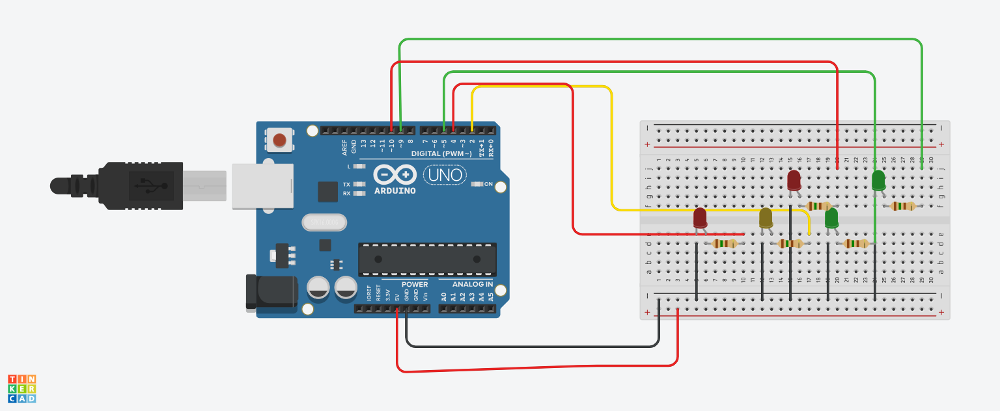

## Semáforo para Veículos e Pedestres

#Introdução.

Este projeto simula o funcionamento de um semáforo para veículos e pedestres.
O sistema controla três LEDs para o semáforo de veículos (vermelho, amarelo e verde) 
e dois LEDs para os sinais de pedestres (pedestre pode atravessar e pedestre deve esperar).
O código foi escrito em C++ e pode ser utilizado em plataformas como Arduino,
permitindo a simulação e controle físico dos LEDs.

# Componentes Utilizados.

- 1 Arduino.
- 1 Protobord.
- 1 Led 3,3 Volts (Vermelho, Amarelo e Verde para veículos).
- 1 Led 3,3 Volts (Vermelho e Verde para Pedestre).
- 5 resistores 150 Ohms.
- 12 Jumpers Macho-Macho.

# Imagem do Circuito.

-- Definição dos pinos para os LEDs do semáforo e pedestre
int ledVermelho = 4;        -- LED Vermelho do semáforo conectado ao pino 4
int ledAmarelo = 2;         -- LED Amarelo do semáforo conectado ao pino 2
int ledVerde = 5;           -- LED Verde do semáforo conectado ao pino 5
int pedestreFechado = 10;   -- LED "Pedestre Fechado" conectado ao pino 10
int pedestreAberto = 9;     -- LED "Pedestre Aberto" conectado ao pino 9

void setup() {
  -- Configuração dos pinos como saída
  pinMode(ledVermelho, OUTPUT);       -- Configura o pino do LED Vermelho como saída
  pinMode(ledAmarelo, OUTPUT);        -- Configura o pino do LED Amarelo como saída
  pinMode(ledVerde, OUTPUT);          -- Configura o pino do LED Verde como saída
  pinMode(pedestreFechado, OUTPUT);   -- Configura o pino do LED "Pedestre Fechado" como saída
  pinMode(pedestreAberto, OUTPUT);    -- Configura o pino do LED "Pedestre Aberto" como saída
}

void loop() {
  -- Fase 1: Semáforo Vermelho para veículos, pedestre pode atravessar
  digitalWrite(ledVermelho, HIGH);    -- Liga o LED Vermelho do semáforo
  digitalWrite(ledAmarelo, LOW);       -- Apaga o LED Amarelo
  digitalWrite(ledVerde, LOW);         -- Apaga o LED Verde
  digitalWrite(pedestreAberto, HIGH);  -- Liga o LED "Pedestre Aberto"
  digitalWrite(pedestreFechado, LOW);  -- Apaga o LED "Pedestre Fechado"
  delay(1900);                         -- Mantém essa fase por 1.9 segundos

-- Fase 2: Semáforo Amarelo para veículos, pedestre deve esperar
  digitalWrite(ledVermelho, LOW);      -- Apaga o LED Vermelho
  digitalWrite(ledAmarelo, HIGH);      -- Liga o LED Amarelo do semáforo
  digitalWrite(ledVerde, LOW);         -- Garante que o LED Verde esteja apagado
  digitalWrite(pedestreAberto, LOW);   -- Apaga o LED "Pedestre Aberto"
  digitalWrite(pedestreFechado, HIGH); -- Liga o LED "Pedestre Fechado"
  delay(1500);                         -- Mantém essa fase por 1.5 segundos

  -- Fase 3: Semáforo Verde para veículos, pedestre deve esperar
  digitalWrite(ledVermelho, LOW);      -- Apaga o LED Vermelho
  digitalWrite(ledAmarelo, LOW);       -- Apaga o LED Amarelo
  digitalWrite(ledVerde, HIGH);        -- Liga o LED Verde do semáforo
  digitalWrite(pedestreAberto, LOW);   -- Apaga o LED "Pedestre Aberto"
  digitalWrite(pedestreFechado, HIGH); -- Mantém o LED "Pedestre Fechado" ligado
  delay(1000);                         -- Mantém essa fase por 1 segundo
}
