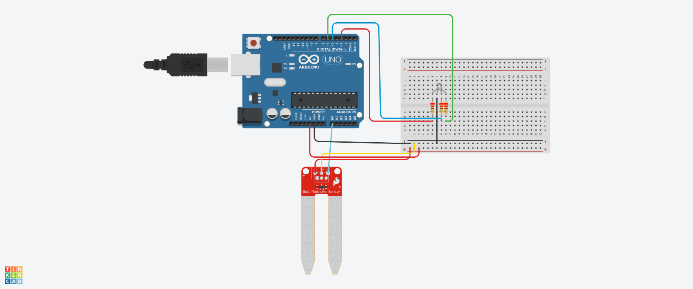

## Monitoramento de Umidade do Solo com LEDs Indicadores.

# Introdução 

Este código foi desenvolvido  no TinkerCard usando a linguagem C++, para monitorar a umidade do solo utilizando um sensor de umidade conectado a um microcontrolador
(Arduino, por exemplo). Dependendo do valor lido pelo sensor, três LEDs indicam visualmente as condições do solo: seco, 
ideal ou úmido. Além disso, o valor de umidade é exibido no monitor serial, possibilitando a visualização em tempo real no computador.

## Observações.

- 1 Notificações adicionais: O sistema pode ser expandido para enviar alertas via comunicação serial para dispositivos externos,
ou incluir funcionalidades IoT para monitoramento remoto.

- 2 Ajuste no intervalo de leituras: O intervalo de 1 segundo entre as leituras pode ser modificado conforme a necessidade de coleta de dados.

- 3 Inclusão de alarmes sonoros ou visuais: Além dos LEDs, pode-se incluir um buzzer para sinalização de solo seco ou úmido de forma audível.

## Componentes Utilizados.

- 1 Sensor de Umidade do Solo (conectado ao pino analógico A0).
- 1 LED Vermelho (conectado ao pino digital 3) – Indica solo seco.
- 1 LED Verde (conectado ao pino digital 6) – Indica solo ideal.
- 1 LED Azul (conectado ao pino digital 5) – Indica solo úmido.
- 1 Arduino (ou outro microcontrolador compatível).
- 6 Jumpers Macho-macho.
- 3 Jumpers macho-Fémea.
- 3 resistores de 220 Ohms.

## Estrutura Montada.

##  Bibliotecas.

#include <SoftwareSerial.h>

Essa biblioteca não é utilizada diretamente no código atual,
mas pode ser necessária para comunicação serial com dispositivos externos via portas digitais (caso expandido).

## Configuração dos Pinos.

# Os pinos são definidos no início do código para facilitar a alteração e visualização:

int sensor = A0;  -- Sensor de umidade do solo
int LedR = 3;     -- LED vermelho (solo seco)
int LedG = 6;     -- LED verde (solo ideal)
int LedB = 5;     -- LED azul (solo úmido)

Sensor de umidade conectado ao pino analógico A0.

LED Vermelho conectado ao pino digital 3.

LED Verde conectado ao pino digital 6.

LED Azul conectado ao pino digital 5.

##  Função setup().

# A função setup() é responsável pela configuração inicial do sistema:

void setup()  
{  
  pinMode(sensor, INPUT);   -- Define o sensor como entrada
  Serial.begin(9600);       -- Inicializa a comunicação serial
  pinMode(LedR, OUTPUT);    -- Define o LED vermelho como saída
  pinMode(LedG, OUTPUT);    -- Define o LED verde como saída
  pinMode(LedB, OUTPUT);    -- Define o LED azul como saída
}

## O que acontece no setup():

O sensor de umidade é configurado como entrada, para leitura de dados.

O monitor serial é inicializado com uma taxa de comunicação de 9600 bps.

Os pinos dos LEDs são configurados como saída, para que possam ser ligados ou desligados de acordo com os níveis de umidade.

##  Função loop()

A função loop() é onde a lógica principal do programa é executada continuamente. 
A cada ciclo, o programa lê o valor do sensor, imprime o valor lido no monitor serial e acende o LED correspondente à condição do solo.

# Passo a Passo:

Leitura da Umidade do Solo:

int umidade = analogRead(sensor);

O valor da umidade é lido como um valor analógico, que varia de 0 a 1023.

# Exibição da Umidade no Monitor Serial:

Serial.print("Umidade do Solo: ");
Serial.println(umidade);

O valor de umidade é impresso no monitor serial para acompanhamento.

# Verificação das Condições do Solo: 

A umidade é comparada a três intervalos distintos:

Solo Seco (umidade < 300):

if (umidade < 300) {
    Serial.println("SOLO SECO");
    analogWrite(LedR, 255);  -- LED vermelho aceso
    analogWrite(LedG, 0);    -- LED verde apagado
    analogWrite(LedB, 0);    -- LED azul apagado
}

## Solo Ideal (300 <= umidade < 500):

if (umidade > 300 && umidade < 500) {
    Serial.println("SOLO IDEAL");
    analogWrite(LedR, 0);    -- LED vermelho apagado
    analogWrite(LedG, 255);  -- LED verde aceso
    analogWrite(LedB, 0);    -- LED azul apagado
}

## Solo Úmido (500 <= umidade < 876):

if (umidade > 500 && umidade < 876) {
    Serial.println("SOLO UMIDO");
    analogWrite(LedR, 0);    -- LED vermelho apagado
    analogWrite(LedG, 0);    -- LED verde apagado
    analogWrite(LedB, 255);  -- LED azul aceso
}

## Valores de umidade:

Menor que 300: O solo está seco. O LED vermelho será aceso.

Entre 300 e 500: O solo está em uma condição ideal. O LED verde será aceso.

Entre 500 e 876: O solo está úmido. O LED azul será aceso.

Intervalo entre as leituras: Cada verificação do solo e impressão no monitor serial é seguida de um atraso de 1 segundo:

delay(1000);

## Código.

-- BIBLIOTECA PARA CONEXÃO SERIAL DO SENSOR
#include <SoftwareSerial.h>

int sensor = A0;  -- PINO DO SENSOR DE UMIDADE DO SOLO
int LedR = 3;     -- PINO DO LED VERMELHO
int LedG = 6;     -- PINO DO LED VERDE
int LedB = 5;     -- PINO DO LED AZUL

void setup()
{
  -- DEFINIR O SENSOR COMO ENTRADA
  pinMode(sensor, INPUT);
  
  -- INICIALIZANDO O MONITOR SERIAL COM A TAXA DE 9600 BPS
  Serial.begin(9600);

  -- DEFINIR OS LEDS COMO SAÍDA
  pinMode(LedR, OUTPUT);
  pinMode(LedG, OUTPUT);
  pinMode(LedB, OUTPUT);
}

void loop()
{
  -- GUARDAR O VALOR LIDO PELO SENSOR DE UMIDADE
  int umidade = analogRead(sensor);
  
  /--IMPRIMIR O VALOR LIDO NO MONITOR SERIAL
  Serial.print("Umidade do Solo: ");
  Serial.println(umidade);
  delay(1000);

  -- VERIFICAR O NÍVEL DE UMIDADE E ATUALIZAR O STATUS DOS LEDS
  if (umidade < 300) {
    -- SE O SOLO ESTÁ SECO
    Serial.println("SOLO SECO");
    Serial.println(umidade);
    delay(1000);

    -- ACENDER O LED VERMELHO (SOLO SECO)
    analogWrite(LedR, 255);
    analogWrite(LedG, 0);
    analogWrite(LedB, 0);
  } 

  -- SE O SOLO ESTÁ EM CONDIÇÃO IDEAL
  if (umidade > 300 && umidade < 500) {
    Serial.println("SOLO IDEAL");
    Serial.println(umidade);
    delay(1000);

    -- ACENDER O LED VERDE (SOLO IDEAL)
    analogWrite(LedR, 0);
    analogWrite(LedG, 255);
    analogWrite(LedB, 0);
  }

  -- SE O SOLO ESTÁ ÚMIDO
  if (umidade > 500 && umidade < 876) {
    Serial.println("SOLO UMIDO");
    Serial.println(umidade);
    delay(1000);

    -- ACENDER O LED AZUL (SOLO ÚMIDO)
    analogWrite(LedR, 0);
    analogWrite(LedG, 0);
    analogWrite(LedB, 255);
  }
}

