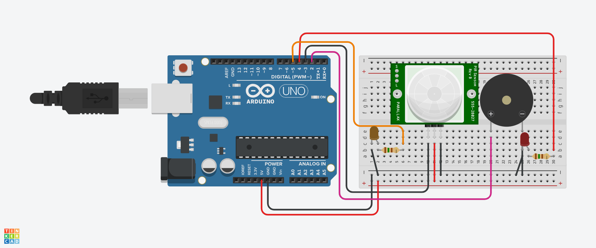

## Sensor de presença com Alarme.
O projeto de Sensor de Presença com Alarme  foi desenvolvido no Tinkercard na linguagem C++,
para ser uma solução eficiente e de baixo custo para aumentar a segurança em ambientes vulneráveis
a incêndios, utilizando tecnologias simples e acessíveis. 
É uma excelente demonstração das capacidades do Arduino em aplicações práticas do dia a dia.

## Introdução.

Os alarmes de incêndio são dispositivos essenciais em sistemas de segurança de edificações,
responsáveis ​​por detectar sinais de fumaça ou calor e alertar os ocupantes sobre o perigo iminente.
Este documento apresenta um código de exemplo para um sistema de alarme de incêndio instalado com um microcontrolador Arduino,
utilizando um sensor PIR (Passive Infrared Sensor). Primeiramente testado no TinkerCard com a linguagem C++.

## Principais Funcionalidades:

Detecção de Incêndio: O sensor PIR monitora a área e reage ao calor emitido por chamas ou fumaça, indicando a possibilidade de um incêndio.

Alarme Sonoro: Ao detectar a presença de calor, o sistema ativa um buzzer, que emite um som alto, alertando os ocupantes do local.

Sinalização Visual: Dois LEDs são utilizados para representar o estado do alarme. 
Eles piscam alternadamente em diferentes frequências sonoras, proporcionando uma indicação visual clara e imediata.

## Componentes Utilizados.

  - 1 Arduino.
  - 1 Piezo.
  - 1 Sensor PIR.
  - 1 Protoboard.
  - 1 Led (Amarelo e Vemelho).
  - 2 Resistores de 150 Ohms.
  - 11 Jumpers Macho-Macho.

    ## Estruturaalarme com sensor PIR.

 ## Código.

 int sensorPIR = 3;  -- DEFINE A PINAGEM DO SENSOR PIR (OU SENSOR DE INCÊNDIO) NO PINO 3
int buzzer = 2;     -- DEFINE A PINAGEM DO BUZZER NO PINO 2
int led1 = 4;       -- DEFINE A PINAGEM DO LED 1 (ASSOCIADO À FREQUÊNCIA 1000 Hz)
int led2 = 5;       -- DEFINE A PINAGEM DO LED 2 (ASSOCIADO À FREQUÊNCIA 3000 Hz)

void setup() {
  pinMode(sensorPIR, INPUT);   -- CONFIGURA O PINO DO SENSOR COMO ENTRADA
  pinMode(buzzer, OUTPUT);     -- CONFIGURA O PINO DO BUZZER COMO SAÍDA
  pinMode(led1, OUTPUT);       -- CONFIGURA O PINO DO LED 1 COMO SAÍDA
  pinMode(led2, OUTPUT);       -- CONFIGURA O PINO DO LED 2 COMO SAÍDA
}

void loop() {
  int detectarIncendio = digitalRead(sensorPIR);  -- LÊ O ESTADO DO SENSOR (1 SE DETECTAR INCÊNDIO, 0 CASO CONTRÁRIO)

  if (detectarIncendio == 1) {  -- SE O SENSOR DETECTAR INCÊNDIO
    for (int i = 0; i < 10; i++) {  -- TOCA O ALARME POR 10 CICLOS
      tone(buzzer, 1000);         -- EMITE UM SOM NA FREQUÊNCIA DE 1000 Hz
      digitalWrite(led1, HIGH);   -- ACENDE O LED1
      digitalWrite(led2, LOW);    -- APAGA O LED2
      delay(500);                 -- ESPERA 500 MILISSEGUNDOS

      tone(buzzer, 3000);         -- EMITE UM SOM NA FREQUÊNCIA DE 3000 Hz
      digitalWrite(led2, HIGH);   -- ACENDE O LED2
      digitalWrite(led1, LOW);    -- APAGA O LED1
      delay(500);                 -- ESPERA 500 MILISSEGUNDOS
    }
  } else {
    noTone(buzzer);               -- DESLIGA O SOM DO BUZZER
    digitalWrite(led1, LOW);      -- APAGA O LED1
    digitalWrite(led2, LOW);      -- APAGA O LED2
  }
}

