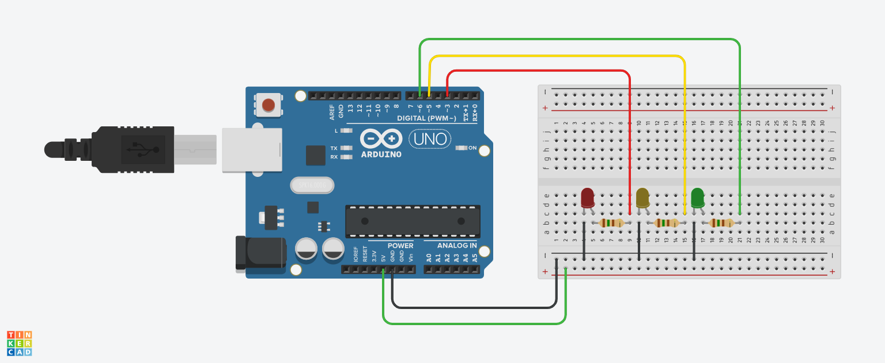

##  Sistema de Controle de Tráfego com LEDs.

Este projeto foi desenvolvido como parte da disciplina Internet das Coisas (IoT)
e simula um sistema de controle de tráfego utilizando LEDs para representar os sinais de um semáforo 
(vermelho, amarelo e verde). Ele foi criado no TinkerCAD, uma plataforma de simulação e prototipagem de circuitos.

# Objetivos. 

O objetivo deste projeto é criar um semáforo básico utilizando LEDs que acendem e apagam de forma sequencial, 
simulando o funcionamento de um semáforo real para gerenciar o fluxo de tráfego e garantir a segurança.

# Componentes Utilizados

- 1 Arduino UNO.
- 1 Protobord.
- 1 Led (Vermelho, Amarelo, Verde).
- 3 Resistores de 150 Komhs.
- 8 Jumpers Macho-Macho.

# Funcionamento do Ciclo
LED Vermelho: Indica "Pare", fica aceso por 2.5 segundos.
LED Amarelo: Indica "Atenção", fica aceso por 1.5 segundos.
LED Verde: Indica "Siga", fica aceso por 1 segundo.

Após o ciclo, o semáforo reinicia a sequência.

# Código.

-- Definição dos pinos para os LEDs (vermelho, amarelo e verde)
int LedVermelho = 3;  -- LED Vermelho conectado ao pino 3
int LedAmarelo = 5;   -- LED Amarelo conectado ao pino 5
int LedVerde = 6;     -- LED Verde conectado ao pino 6

void setup() {
  -- Configuração dos pinos dos LEDs como saídas para que possam ser controlados
  pinMode(LedVermelho, OUTPUT);  -- Define o pino do LED Vermelho como saída
  pinMode(LedAmarelo, OUTPUT);   -- Define o pino do LED Amarelo como saída
  pinMode(LedVerde, OUTPUT);     -- Define o pino do LED Verde como saída
}

void loop() {
  -- Acender o LED Vermelho (simulando a luz de "Pare" do semáforo)
  digitalWrite(LedVermelho, HIGH);  -- Liga o LED Vermelho
  digitalWrite(LedAmarelo, LOW);    -- Garante que o LED Amarelo esteja apagado
  digitalWrite(LedVerde, LOW);      -- Garante que o LED Verde esteja apagado
  delay(2500);                      -- Mantém o LED Vermelho aceso por 2.5 segundos

  -- Acender o LED Amarelo (simulando a luz de "Atenção" do semáforo)
  digitalWrite(LedVermelho, LOW);   -- Apaga o LED Vermelho
  digitalWrite(LedAmarelo, HIGH);   -- Liga o LED Amarelo
  digitalWrite(LedVerde, LOW);      -- Garante que o LED Verde esteja apagado
  delay(1500);                      -- Mantém o LED Amarelo aceso por 1.5 segundos

  -- Acender o LED Verde (simulando a luz de "Siga" do semáforo)
  digitalWrite(LedVermelho, LOW);   -- Garante que o LED Vermelho esteja apagado
  digitalWrite(LedAmarelo, LOW);    -- Apaga o LED Amarelo
  digitalWrite(LedVerde, HIGH);     -- Liga o LED Verde
  delay(1000);                      -- Mantém o LED Verde aceso por 1 segundo

  -- O ciclo reinicia automaticamente a partir daqui
}

