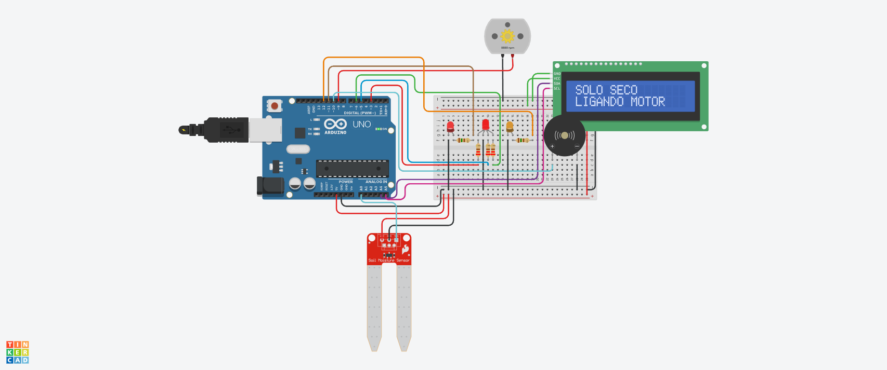

## Sistema de Monitoramento de Umidade do Solo.

## Introdução.

O presente código é um sistema de monitoramento de umidade do solo, destinado a uso em projetos de automação e jardinagem. 
Ele permite que o usuário verifique as condições de umidade do solo, acionando LEDs, um motor para irrigação, 
um buzzer para alertas sonoros e um display LCD para exibir informações relevantes.

## Objetivos do Sistema.

Monitoramento de Umidade: Avaliar a umidade do solo em tempo real.
Indicação Visual e Auditiva: Utilizar LEDs e um buzzer para alertar o usuário sobre as condições do solo.
Interface de Usuário: Fornecer informações claras e visíveis no display LCD.

# Aplicações.

Agricultura de precisão.
Jardinagem automatizada.
Monitoramento de plantas domésticas.

## Hardware Necessário.

# Componentes.

- 1 Microcontrolador: Arduino Uno, Nano ou similar.
- 1 Sensor de Umidade do Solo: Para medir a umidade do solo (ex. YL-69).
- 1 Display LCD: Display de 16x2 com interface I2C.
# LEDs:
- 1 LED Vermelho: Indica solo seco.
- 1 LED Verde: Indica solo em condições ideais.
- 1 LED Azul: Indica solo úmido.
- 
- 1 Motor CC: Para acionar uma bomba de água quando o solo estiver seco.
- 1 Buzzer: Emissão de som para alertas.
- 3 Resistores: Para proteção dos LEDs (geralmente 220 Ohms).
- 1 Protoboard: Para facilitar a montagem do circuito.
- 2 Resistores de 150 Ohms.
- 1 led (Vermelho e Laranja).
- 

## Estrutura Montada Funcionando.

# Dependências

Para o funcionamento do código, é necessário incluir as seguintes bibliotecas:

LiquidCrystal_I2C: Biblioteca que permite a comunicação com displays LCD utilizando o protocolo I2C.

SoftwareSerial: Biblioteca que possibilita a criação de uma porta serial em qualquer pino digital do Arduino,
útil para comunicação com dispositivos que não estão nas portas seriais padrão.

## Conexões.

# Componente.

Pino Arduino.
Sensor de Umidade:            A0
LED Vermelho:                	3
LED Verde:                   	6
LED Azul:                   	5
MotorCC:                    	9
Buzzer:                     	10
LED1:                        	11
LED2:                       	12
VCC do LCD:                  	5V
GND do LCD:                 	GND
SDA do LCD:                 	A4 (Arduino Uno)
SCL do LCD:                 	A5 (Arduino Uno)

##  Estrutura do Código.

# Definição de Bibliotecas e Inicialização de Variáveis.

#include <LiquidCrystal_I2C.h> -- Biblioteca para LCD
#include <SoftwareSerial.h>     -- Biblioteca para comunicação serial

-- Inicializa o LCD no endereço I2C 0x20 com 16 colunas e 2 linhas
LiquidCrystal_I2C telaLcd(0x20, 16, 2);

-- Definição dos pinos
int sensor = A0;  -- Pino do sensor de umidade do solo
int LedR = 3;     -- Pino do LED vermelho (indica solo seco)
int LedG = 6;     -- Pino do LED verde (indica solo ideal)
int LedB = 5;     -- Pino do LED azul (indica solo úmido)
int motor = 9;    -- Pino do motor (acionado quando o solo está seco)
int buzzer = 10;  -- Pino do buzzer
int led1 = 11;    -- Pino do LED1
int led2 = 12;    -- Pino do LED2

## Função setup()

Objetivo: Inicializar componentes, configurar pinos e preparar a interface de usuário.

# Ações:

Inicializa o display LCD e exibe uma mensagem de inicialização.
Ativa a luz de fundo do LCD.
Configura os pinos dos LEDs, motor, buzzer e sensor.

void setup() {
    telaLcd.init(); -- Inicializa o LCD
    telaLcd.clear(); -- Limpa qualquer dado que esteja na tela do LCD
    telaLcd.setCursor(0, 0); -- Define o cursor para a posição (coluna 0, linha 0)
    telaLcd.print("INICIALIZANDO..."); -- Exibe "INICIALIZANDO..."
    telaLcd.backlight(); -- Ativa a luz de fundo do LCD
    
    -- Configura os pinos
    pinMode(sensor, INPUT); -- Sensor como entrada
    pinMode(buzzer, OUTPUT); -- Buzzer como saída
    pinMode(led1, OUTPUT); -- LED1 como saída
    pinMode(led2, OUTPUT); -- LED2 como saída
    Serial.begin(9600); -- Inicializa a comunicação serial para depuração
    
    pinMode(LedR, OUTPUT); -- LED vermelho como saída
    pinMode(LedG, OUTPUT); -- LED verde como saída
    pinMode(LedB, OUTPUT); -- LED azul como saída
    pinMode(motor, OUTPUT); -- Motor como saída
}

## Função loop()

# Objetivo: Monitorar continuamente a umidade do solo e tomar ações baseadas nos níveis detectados.

# Ações:

Lê o valor de umidade do sensor.
Exibe o valor no monitor serial.
Verifica as condições do solo (seco, ideal, úmido) e acende LEDs, liga o motor e emite sons conforme necessário.

void loop() {
    int umidade = analogRead(sensor); -- Lê o valor do sensor de umidade

    -- Exibe o valor da umidade no monitor serial
    Serial.print("UMIDADE DO SOLO: ");
    Serial.println(umidade);
    delay(1000); -- Atraso de 1 segundo

    -- Condição para solo seco
    if (umidade <= 300) {  
        Serial.println("SOLO SECO");
        delay(600);
        analogWrite(LedR, 255);  -- Acende o LED vermelho
        analogWrite(LedG, 0);    -- Apaga o LED verde
        analogWrite(LedB, 0);    -- Apaga o LED azul
        digitalWrite(motor, HIGH); -- Liga o motor

        -- Limpa a tela LCD e exibe nova mensagem
        telaLcd.clear();
        telaLcd.setCursor(0, 0);
        telaLcd.print("SOLO SECO");
        telaLcd.setCursor(0, 1);
        telaLcd.print("LIGANDO MOTOR");
        
        -- Aciona o buzzer e LEDs adicionais
        for (int i = 0; i < 10; i++) {
            tone(buzzer, 59); -- Emite um tom no buzzer
            digitalWrite(led1, HIGH);
            digitalWrite(led2, LOW);
            delay(600);
            
            tone(buzzer, 60);
            digitalWrite(led1, LOW);
            digitalWrite(led2, HIGH);
            delay(600);
        }
    } else {
        noTone(buzzer); -- Para o som do buzzer
        digitalWrite(led1, LOW);
        digitalWrite(led2, LOW);
    }

    -- Condição para solo ideal
    if (umidade > 300 && umidade <= 500) {
        Serial.println("SOLO IDEAL");
        delay(600);
        analogWrite(LedR, 0);    -- Apaga o LED vermelho
        analogWrite(LedG, 255);  -- Acende o LED verde
        analogWrite(LedB, 0);    -- Apaga o LED azul
        digitalWrite(motor, LOW); -- Desliga o motor

        -- Limpa a tela LCD e exibe nova mensagem
        telaLcd.clear();
        telaLcd.setCursor(0, 0);
        telaLcd.print("SOLO IDEAL");
    }

    -- Condição para solo úmido
    if (umidade > 500 && umidade <= 876) {
        Serial.println("SOLO UMIDO");
        delay(600);
        analogWrite(LedR, 0);    -- Apaga o LED vermelho
        analogWrite(LedG, 0);    -- Apaga o LED verde
        analogWrite(LedB, 255);  -- Acende o LED azul

        -- Limpa a tela LCD e exibe nova mensagem
        telaLcd.clear();
        telaLcd.setCursor(0, 0);
        telaLcd.print("SOLO UMIDO");
    }
}

##  Condições de Umidade.

O sistema é projetado para monitorar a umidade do solo e tomar ações apropriadas com base nas leituras do sensor.
As leituras variam de 0 a 1023, correspondendo a diferentes níveis de umidade do solo.
A lógica do código categoriza a umidade em três estados distintos, cada um acionando diferentes componentes do sistema:

# Solo Seco.

Intervalo de Umidade: umidade <= 300
Descrição: Quando a leitura do sensor indica que o solo está seco (nível de umidade abaixo ou igual a 300), o sistema entra neste estado.

# Ações Executadas:

LED Vermelho: O LED vermelho é acionado em intensidade máxima (255) para alertar visualmente que o solo está seco.
Motor: O motor é ligado para ativar uma bomba de água, irrigando o solo. A lógica aqui é que a planta precisa de água para sobreviver.
LCD: O display LCD é limpo e exibe a mensagem "SOLO SECO" e "LIGANDO MOTOR" para informar ao usuário sobre a condição atual.
Buzzer e LEDs Adicionais: Um loop é ativado, alternando sons e estados de dois LEDs adicionais (led1 e led2) para fornecer
um feedback auditivo e visual durante a ação de irrigação.

if (umidade <= 300) {
    Serial.println("SOLO SECO");
    -- Ações a serem executadas
    analogWrite(LedR, 255);  -- Acende LED vermelho
    digitalWrite(motor, HIGH); -- Liga o motor
    -- Atualiza o LCD
    telaLcd.print("SOLO SECO");
    telaLcd.print("LIGANDO MOTOR");
    -- Loop de alerta
    for (int i = 0; i < 10; i++) {
        tone(buzzer, 59);
        -- Alterna LEDs
    }
}

##  Solo Ideal.

Intervalo de Umidade: umidade > 300 && umidade <= 500

Descrição: Este intervalo indica que a umidade do solo está em um nível ideal para a maioria das plantas (entre 300 e 500).

# Ações Executadas:

LED Verde: O LED verde é acionado em intensidade máxima (255) para indicar que as condições do solo são favoráveis.
Motor: O motor é desligado, pois não é necessário irrigar o solo em condições ideais.
LCD: O display LCD é atualizado para exibir a mensagem "SOLO IDEAL", informando o usuário de que não são necessárias ações imediatas.

if (umidade > 300 && umidade <= 500) {
    Serial.println("SOLO IDEAL");
    -- Ações a serem executadas
    analogWrite(LedG, 255);  -- Acende LED verde
    digitalWrite(motor, LOW); -- Desliga o motor
    -- Atualiza o LCD
    telaLcd.print("SOLO IDEAL");
}

##  Solo Úmido.

Intervalo de Umidade: umidade > 500 && umidade <= 876

Descrição: A leitura do sensor indica que o solo está úmido (entre 500 e 876). 
Esta condição é geralmente segura, mas se a umidade ultrapassar 876, pode-se entrar em risco de encharcamento.

# Ações Executadas:

LED Azul: O LED azul é acionado em intensidade máxima (255) para indicar que o solo está úmido.
Motor: O motor permanece desligado, já que o solo não necessita de irrigação.
LCD: O display LCD é atualizado para exibir a mensagem "SOLO ÚMIDO", permitindo ao usuário saber que o solo está suficientemente irrigado.

if (umidade > 500 && umidade <= 876) {
    Serial.println("SOLO UMIDO");
    -- Ações a serem executadas
    analogWrite(LedB, 255);  -- Acende LED azul
    digitalWrite(motor, LOW); -- Mantém o motor desligado
    -- Atualiza o LCD
    telaLcd.print("SOLO UMIDO");
}

##  Considerações Finais / Observações.

# Limites de Umidade: 
Os limites de umidade (300, 500 e 876) podem ser ajustados conforme a necessidade das plantas em questão.

É importante testar esses limites em condições reais de cultivo.

# Sensores:

A precisão da leitura do sensor pode variar dependendo do tipo e da qualidade do sensor de umidade do solo utilizado. 
Testes práticos são recomendados para calibrar os valores.
Feedback Visual e Auditivo: O uso de LEDs e buzzer proporciona um feedback efetivo para o usuário, tornando o sistema mais interativo e intuitivo.

# Expansões Futuras: 

O sistema pode ser ampliado para incluir conectividade sem fio (como Wi-Fi ou Bluetooth) para monitoramento remoto,
bem como a adição de mais sensores para monitorar outros parâmetros (como temperatura e pH do solo).

## Código.

#include <LiquidCrystal_I2C.h>

-- INICIALIZAR O LCD NO ENDEREÇO I2C 0X20 COM 16 COLUNAS E 2 LINHAS
LiquidCrystal_I2C telaLcd(0x20, 16, 2);

-- BIBLIOTECA PARA CONEXÃO SERIAL DO SENSOR
#include <SoftwareSerial.h>

-- DEFINIÇÃO DOS PINOS PARA OS COMPONENTES
int sensor = A0;  -- PINO DO SENSOR DE UMIDADE DO SOLO
int LedR = 3;     -- PINO DO LED VERMELHO (INDICA SOLO SECO)
int LedG = 6;     -- PINO DO LED VERDE (INDICA SOLO IDEAL)
int LedB = 5;     -- PINO DO LED AZUL (INDICA SOLO ÚMIDO)
int motor = 9;    -- PINO DO MOTOR (ACIONADO QUANDO O SOLO ESTÁ SECO)
int buzzer = 10;
int led1 = 11;
int led2 = 12;

void setup() {
  
  -- INICIALIZAR A TELA LCD
  telaLcd.init();

  -- LIMPAR QUALQUER DADO QUE ESTEJA NA TELA DO LCD
  telaLcd.clear();
  
  -- EXIBIR UMA MENSAGEM DE INICIALIZAÇÃO NO LCD
  telaLcd.setCursor(0, 0); -- DEFINIR O CURSOR PARA A POSIÇÃO (COLUNA 0, LINHA 0)
  telaLcd.print("INICIALIZANDO..."); -- EXIBE "INICIALIZANDO..." NA PRIMEIRA LINHA
  
  -- ATIVAR A LUZ DE FUNDO DO LCD
  telaLcd.backlight();
  
  -- DEFINIR O SENSOR COMO ENTRADA
  pinMode(sensor, INPUT);
  pinMode(buzzer,OUTPUT);
  pinMode(led1, OUTPUT);
  pinMode(led2, OUTPUT);
  
  // INICIALIZAR A COMUNICAÇÃO SERIAL COM O COMPUTADOR PARA DEPURAÇÃO
  Serial.begin(9600);

  // DEFINIR OS PINOS DOS LEDS COMO SAÍDA
  pinMode(LedR, OUTPUT);
  pinMode(LedG, OUTPUT);
  pinMode(LedB, OUTPUT);
  
  -- DEFINIR O PINO DO MOTOR COMO SAÍDA
  pinMode(motor, OUTPUT);
}

void loop() {
  -- LER O VALOR DO SENSOR DE UMIDADE DO SOLO (0 A 1023)
  int umidade = analogRead(sensor);
  
  -- EXIBIR O VALOR DA UMIDADE NO MONITOR SERIAL PARA DEPURAÇÃO
  Serial.print("UMIDADE DO SOLO: ");
  Serial.println(umidade);
  delay(1000);

  -- VERIFICAR O NÍVEL DE UMIDADE DO SOLO E ATUALIZAR LEDS E MOTOR
  if (umidade <= 300) {  -- CONDIÇÃO PARA SOLO SECO
    Serial.println("SOLO SECO");
    Serial.println(umidade);
    
    delay(600);

    -- ACENDER O LED VERMELHO PARA INDICAR SOLO SECO
    analogWrite(LedR, 255);  -- ACENDER O LED VERMELHO
    analogWrite(LedG, 0);    -- APAGAR O LED VERDE
    analogWrite(LedB, 0);    -- APAGAR O LED AZUL
    digitalWrite(motor, HIGH); -- LIGAR O MOTOR (ACIONAR BOMBA DE ÁGUA)

    -- LIMPAR A TELA LCD E EXIBIR NOVA MENSAGEM PARA SOLO SECO
    telaLcd.clear();
    telaLcd.setCursor(0, 0); -- DEFINIR O CURSOR PARA A POSIÇÃO (COLUNA 0, LINHA 0)
    telaLcd.print("SOLO SECO"); -- EXIBIR "SOLO SECO" NA PRIMEIRA LINHA
    telaLcd.setCursor(0, 1); -- DEFINIR O CURSOR PARA A SEGUNDA LINHA
    telaLcd.print("LIGANDO MOTOR"); -- EXIBIR "LIGANDO MOTOR" NA SEGUNDA LINHA
    
    -- LAÇO PARA ACIONAR BUZZER E LEDS
    for (int i = 0; i < 10; i++) {
      tone(buzzer, 59);
      digitalWrite(led1, HIGH);
      digitalWrite(led2, LOW);
      delay(600);  -- PEQUENA PAUSA ANTES DE CONTINUAR O LOOP
     
      tone(buzzer, 60);
      digitalWrite(led1, LOW);
      digitalWrite(led2, HIGH);
      delay(600);
    }
  } else {
    noTone(buzzer);
    digitalWrite(led1, LOW);
    digitalWrite(led2, LOW);
  }

  -- CONDIÇÃO PARA SOLO IDEAL (UMIDADE ENTRE 300 E 500)
  if (umidade > 300 && umidade <= 500) {
    Serial.println("SOLO IDEAL");
    Serial.println(umidade);
    delay(600);

    -- ACENDER O LED VERDE PARA INDICAR SOLO IDEAL
    analogWrite(LedR, 0);    -- APAGAR O LED VERMELHO
    analogWrite(LedG, 255);  -- ACENDER O LED VERDE
    analogWrite(LedB, 0);    -- APAGAR O LED AZUL
    digitalWrite(motor, LOW); -- DESLIGAR O MOTOR (NÃO É NECESSÁRIO REGAR)

    -- LIMPAR A TELA LCD E EXIBIR NOVA MENSAGEM PARA SOLO IDEAL
    telaLcd.clear();
    telaLcd.setCursor(0, 0); -- DEFINIR O CURSOR PARA A POSIÇÃO (COLUNA 0, LINHA 0)
    telaLcd.print("SOLO IDEAL"); -- EXIBIR "SOLO IDEAL" NA TELA
  }

--   CONDIÇÃO PARA SOLO ÚMIDO (UMIDADE ENTRE 500 E 876)
  if (umidade > 500 && umidade <= 876) {
    Serial.println("SOLO UMIDO");
    Serial.println(umidade);
    delay(600);

    -- ACENDER O LED AZUL PARA INDICAR SOLO ÚMIDO
    analogWrite(LedR, 0);    -- APAGAR O LED VERMELHO
    analogWrite(LedG, 0);    -- APAGAR O LED VERDE
    analogWrite(LedB, 255);  -- AC
  }
}

