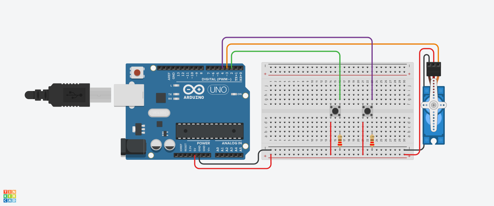

##  Controle de Servo Motor com Botões.

Este projeto foi criado no TinkerCard na linguagem C++ tendo um motor  utilizando dois botões: 
um para aumentar o ângulo e outro para diminuir o ângulo do servo.
O movimento é realizado em incrementos e decrementos conforme os botões são pressionados.
A biblioteca Servo.h é utilizada para a comunicação e controle do servo motor.
Sendo útil para fechar trancas ou deligar um interruptor por exemplo.

## Funcionamento
O servo motor começa na posição inicial de 0°.
Quando o Botão 1 é pressionado, o ângulo do servo aumenta em incrementos de 10° até atingir o limite máximo de 180°.
Quando o Botão 2 é pressionado, o ângulo do servo diminui em decrementos de 5° até atingir o limite mínimo de 0°.

## Bibliotecas Utilizadas
Servo.h: Esta biblioteca facilita o controle de servo motores em microcontroladores como o Arduino. 
Ela permite definir o pino de controle do servo e enviar sinais PWM para ajustar o ângulo.

## Componentes Utilizados.

- 1 Arduino Uno.
- 1 Protoboard.
- 2 Boto~es.
- 1 Micro Servo.
- 2 Resistores de 220 Ohms.
- 3 Jumpers Macho-Fémea.
- 6 Jumpers Macho-Macho.

## Imagem do Arduino Contruido com Micro Servo.

## Variáveis

Servo objetoservo: Objeto criado a partir da classe Servo, usado para controlar o servo motor.

int servo: Define o pino de controle do servo motor (neste caso, o pino digital 3).

int botao: Pino onde o Botão 1 está conectado (neste caso, o pino digital 2).

int botao02: Pino onde o Botão 2 está conectado (neste caso, o pino digital 4).

int posicao: Variável que armazena a posição atual do servo motor, iniciando em 0°.

int posicao02: Representa a posição máxima do servo (180°). Esta variável não é usada diretamente no loop.

## Funções

void setup()
Função: Configura os parâmetros iniciais do sistema.

# Objetivo:

Inicializar o servo motor no pino 3.
Definir os pinos dos botões como entradas (usando INPUT).
Definir a posição inicial do servo para 0° e manter um atraso de 2 segundos antes de iniciar o loop principal.

void setup() {
  objetoservo.attach(servo); -- Inicializa o controle do servo no pino 3.
  pinMode(botao, INPUT);     -- Define o pino 2 como entrada (botão 1).
  pinMode(botao02, INPUT);   -- Define o pino 4 como entrada (botão 2).
  objetoservo.write(posicao); -- Posiciona o servo em 0°.
  delay(2000);               -- Atraso de 2 segundos para estabilizar o sistema.
}

## void loop()

Função: Executa repetidamente para ler o estado dos botões e controlar o movimento do servo.

# Objetivo:

Ler o estado do Botão 1 (pino 2). Se o botão estiver pressionado e o ângulo for menor que 180°, o servo aumenta sua posição em 10°.

Ler o estado do Botão 2 (pino 4). Se o botão estiver pressionado e o ângulo for maior que 0°, o servo diminui sua posição em 5°.

Após cada ajuste de posição, o código impõe um pequeno atraso (10ms) para suavizar o movimento.

# void loop() {
  -- Verifica se o Botão 1 foi pressionado e se o ângulo é menor que 180°
  if (digitalRead(botao) == HIGH && posicao < 180) {
    posicao = posicao + 10; -- Aumenta o ângulo do servo em 10°
    objetoservo.write(posicao); -- Atualiza o servo para a nova posição
    delay(10); -- Pequeno atraso para suavizar o movimento
  }

  -- Verifica se o Botão 2 foi pressionado e se o ângulo é maior que 0°
  if (digitalRead(botao02) == HIGH && posicao > 0) {
    posicao = posicao - 5; -- Diminui o ângulo do servo em 5°
    objetoservo.write(posicao); -- Atualiza o servo para a nova posição
    delay(10); -- Pequeno atraso para suavizar o movimento
  }
}

## Pontos Importantes

Limite de Ângulo: O código garante que o ângulo do servo não ultrapasse 180° nem seja inferior a 0°, evitando danos ao motor.
Atraso Controlado: Um atraso de 10 milissegundos é adicionado após cada movimento para evitar movimentos abruptos.
Incrementos e Decrementos Variáveis: 
O servo motor é movido em incrementos de 10° quando o Botão 1 é pressionado e em decrementos de 5° quando o Botão 2 é pressionado. 
Esses valores podem ser ajustados conforme a necessidade de precisão.

## Possíveis Melhorias

- 1 Implementar um controle mais preciso, utilizando pulsos PWM mais sofisticados ou sensores de feedback.

- 2 Adicionar um debounce de software para evitar leitura incorreta de múltiplos sinais quando os botões são pressionados rapidamente.

- 3 Modificar os incrementos/decrementos para serem ajustáveis via interface ou parâmetros de entrada do usuário.

## Código.

-- BIBLIOTECA DO SERVO MOTOR
#include <Servo.h>

-- CRIANDO OBJETO DO TIPO SERVO MOTOR
Servo objetoservo;

-- VARIÁVEIS PARA SALVAR AS PORTAS DO SERVO E DOS BOTÕES
int servo = 3;
int botao = 2;     -- Botão para aumentar a posição
int botao02 = 4;   -- Botão para diminuir a posição

 -- VARIÁVEIS PARA A POSIÇÃO DO SERVO
int posicao = 0;   -- Posição inicial do servo
int posicao02 = 180; -- Posição máxima do servo

void setup() {
  -- Inicialização do servo
  objetoservo.attach(servo); 

  -- DEFINIR BOTÕES COMO ENTRADA
  pinMode(botao, INPUT);
  pinMode(botao02, INPUT);

  -- Definir a posição inicial do servo
  objetoservo.write(posicao);
  delay(2000);
}

void loop() {
  -- SE O BOTÃO 1 FOR PRESSIANDO, GIRA O SERVO A 1°
  if (digitalRead(botao) == HIGH && posicao < 180) {
    posicao = posicao +10;-- PODE SER USADO TAMBEM posicao ++10
    objetoservo.write(posicao);
    delay(10); -- Atraso para o movimento
  }

  -- SE O BOTÃO 2 FOR PRESSIANDO, RETROCEDE O SERVO A 1°
  if (digitalRead(botao02) == HIGH && posicao > 0) {
    posicao = posicao -5; -- PODE SER USADO TAMBEM posicao -- 5;
    objetoservo.write(posicao);
    delay(10); -- Atraso para o movimento
  }
}
