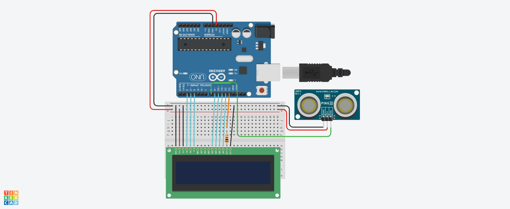

# projeto de Tela LCD com sensor de Distância

Este projeto foi densenvolvido dentro do TinkerCard, na disciplina de Internet das Coisas (OIT), para a criação de um protoipo com arduino que simule 
uma mensagem de Mantenha Distância toda vez que alguém se aproxime a menos de 1 metro do sensor.

## Componentes Usados 
- 1 Arduino UNO
- 1 Protobord
- 1 Tela LCD 16x2
- 14 Jumpers Macho-Macho
- 3 Jumpers Macho-Fémea
- 1 resistor de 1 kOhms
- Sensor de Distância

## Montagem do Circuito

## Explicação do Código

Importando a biblioteca do LCD.
#include <LiquidCristal.h>
--Criar variavel LCD. 

LiquidCrystal lcd(2, 3, 4, 9, 10, 11, 12);

int ledLcd = 13;

--METODO PARA CAPTURAR A DISTANCIA 
--RETORNA NUMERO QUEBRADO LONGO 
long distancia(int trigger, int echo){
--TRIGGER PORTA DE SAIDA
  pinMode(trigger,OUTPUT);
  digitalWrite(trigger,LOW);
  delay(5); --espere 5 milisegundos.
  --MANDANDO SINAL 
  digitalWrite(trigger,HIGH);
  delay(10);
  digitalWrite(trigger,LOW);
  echo porta de entrada
  pinMode(echo,INPUT);
 --RETORNA OD DADOS QUE A PORTA RECEBE 
 return pulseIn(echo,HIGH);
  

}

void setup()
{
  
  pinMode(ledLcd, OUTPUT);      -- DEFINIR LEDLCD SAIDA.
  digitalWrite(ledLcd, HIGH);   -- LIGAR OS LEDS DO LCD.
  lcd.begin(16, 2);              --Informar que o lcd tem 16 colunas e 2 linhas.
  lcd.clear();                   --Iniciar o lcd limpo.
}

void loop()
{
 --TRANSFORMAR O VALOR RECEBIDO PARA CM
  int cm = 0.01723 * distancia (8,8);
  
  if(cm<100){ --SE MENOS QUE 1 METRO/100CM
    lcd.setCursor(0,0); --INICIAR A ESCRIITA NA LINHA 0 COLUNA
    lcd.print("MANTENHA");
    lcd.setCursor(0,1); --INICIAR A ESCRITA NA LINHA 0 COLUNA
    lcd.print("DISTANCIA!");    
  }else{ senão
    lcd.clear();-- APAGUE TODAS AS MENSAGENS DO DISPLAY.
  }
 
 
  
}

