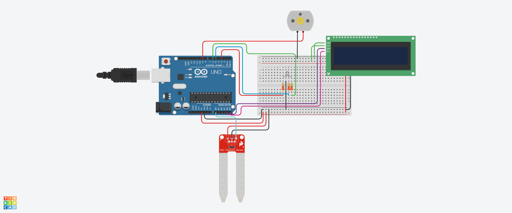

## Sistema de Monitoramento de Umidade do Solo.

Este sistema foi projetado para monitorar o nível de umidade do solo utilizando um sensor analógico de umidade. 
Dependendo do nível de umidade detectado, o sistema:

Exibe mensagens em um display LCD.

Aciona LEDs coloridos (vermelho, verde, azul) para indicar o status da umidade.

Controla um motor que pode simular o acionamento de uma bomba de água.

## Componentes Utilizados.

- 1 Arduino Uno.
- 1 protoboard.
- 1 Sensor de umidade do Solo.
- 1 Motor CC.
- 1 LCD 16x2 (I2C).
- 3 Resistores de 220 Ohms.
- 1 LED RGB.
- 9 Jumpers Macho-Fémea.
- 8 Jumpers Macho-Macho.

##  Bibliotecas Utilizadas

# LiquidCrystal_I2C

Biblioteca usada para controlar o display LCD com interface I2C.

Endereço I2C: 0x20.

Tela com 16 colunas e 2 linhas.

# SoftwareSerial

Biblioteca incluída para comunicação serial (não utilizada no código atual, mas pode ser usada para fins futuros).

##  Descrição do Código

 Inicialização do Sistema (setup())
 
Na função setup(), o sistema realiza as seguintes etapas:

# Inicialização do LCD:

A tela LCD é inicializada e uma mensagem de boas-vindas "INICIALIZANDO..." é exibida.
A função telaLcd.backlight() é chamada para acender a luz de fundo da tela.

# Configuração dos pinos:

O pino do sensor de umidade é configurado como entrada (pino analógico A0).
Os pinos dos LEDs e do motor são configurados como saídas (pinos digitais).
Inicialização da comunicação serial:
A comunicação serial é inicializada com a taxa de 9600 bits por segundo (bps), para enviar e receber dados do monitor serial.

# Ciclo Principal (loop())

A função loop() é o coração do sistema, repetidamente executando as seguintes tarefas:

# Leitura da Umidade do Solo:

A função analogRead(sensor) lê o valor do sensor de umidade, que varia de 0 a 1023.
O valor lido é exibido no monitor serial usando Serial.print() e Serial.println().

# Lógica Condicional:

Dependendo do valor de umidade lido, três cenários diferentes são tratados:

a) Solo Seco (umidade < 300)
O LED vermelho é aceso para indicar solo seco.
O motor é acionado (simulando o funcionamento de uma bomba d'água).
A tela LCD exibe a mensagem "SOLO SECO" e "LIGANDO MOTOR".

b) Solo Ideal (300 ≤ umidade < 500)
O LED verde é aceso para indicar que a umidade está em um nível ideal.
O motor permanece desligado.
A tela LCD exibe "SOLO IDEAL".

c) Solo Úmido (500 ≤ umidade < 876)
O LED azul é aceso para indicar solo úmido.
O motor permanece desligado.
A tela LCD exibe "SOLO UMIDO".

Explicação das Principais Funções e Variáveis

# Variáveis Principais

sensor: Define o pino onde o sensor de umidade está conectado (A0).

LedR, LedG, LedB: Controlam os LEDs (vermelho, verde e azul) para indicar o status do solo.

motor: Controla o acionamento do motor (pino 9).

telaLcd: Objeto da classe LiquidCrystal_I2C para controle do display LCD.

# Funções Principais

Função setup()

## Código.

#include <LiquidCrystal_I2C.h>

-- INICIALIZAR O LCD NO ENDEREÇO I2C 0X20 COM 16 COLUNAS E 2 LINHAS
LiquidCrystal_I2C telaLcd(0x20, 16, 2);

-- BIBLIOTECA PARA CONEXÃO SERIAL DO SENSOR
#include <SoftwareSerial.h>

-- DEFINIÇÃO DOS PINOS PARA OS COMPONENTES
int sensor = A0;  -- PINO DO SENSOR DE UMIDADE DO SOLO
int LedR = 3;     -- PINO DO LED VERMELHO (INDICA SOLO SECO)
int LedG = 6;     -- PINO DO LED VERDE (INDICA SOLO IDEAL)
int LedB = 5;     -- PINO DO LED AZUL (INDICA SOLO ÚMIDO)
int motor = 9;    -- PINO DO MOTOR (ACIONADO QUANDO O SOLO ESTÁ SECO)

void setup() {
  
  -- INICIALIZAR A TELA LCD
  telaLcd.init();

  -- LIMPAR QUALQUER DADO QUE ESTEJA NA TELA DO LCD
  telaLcd.clear();
  
  -- EXIBIR UMA MENSAGEM DE INICIALIZAÇÃO NO LCD
  telaLcd.setCursor(0, 0); -- DEFINIR O CURSOR PARA A POSIÇÃO (COLUNA 0, LINHA 0)
  telaLcd.print("INICIALIZANDO..."); -- EXIBE "INICIALIZANDO..." NA PRIMEIRA LINHA
  
  -- ATIVAR A LUZ DE FUNDO DO LCD
  telaLcd.backlight();
  
  -- DEFINIR O SENSOR COMO ENTRADA
  pinMode(sensor, INPUT);
  
  -- INICIALIZAR A COMUNICAÇÃO SERIAL COM O COMPUTADOR PARA DEPURAÇÃO
  Serial.begin(9600);

  -- DEFINIR OS PINOS DOS LEDS COMO SAÍDA
  pinMode(LedR, OUTPUT);
  pinMode(LedG, OUTPUT);
  pinMode(LedB, OUTPUT);
  
  -- DEFINIR O PINO DO MOTOR COMO SAÍDA
  pinMode(motor, OUTPUT);
}

void loop() {
  -- LER O VALOR DO SENSOR DE UMIDADE DO SOLO (0 A 1023)
  int umidade = analogRead(sensor);
  
  -- EXIBIR O VALOR DA UMIDADE NO MONITOR SERIAL PARA DEPURAÇÃO
  Serial.print("UMIDADE DO SOLO: ");
  Serial.println(umidade);
  delay(1000);

  -- VERIFICAR O NÍVEL DE UMIDADE DO SOLO E ATUALIZAR LEDS E MOTOR
  if (umidade < 300) {  -- CONDIÇÃO PARA SOLO SECO
    Serial.println("SOLO SECO");
    Serial.println(umidade);
    
    delay(800);

    -- ACENDER O LED VERMELHO PARA INDICAR SOLO SECO
    analogWrite(LedR, 255);  -- ACENDER O LED VERMELHO
    analogWrite(LedG, 0);    -- APAGAR O LED VERDE
    analogWrite(LedB, 0);    -- APAGAR O LED AZUL
    analogWrite(motor, HIGH); -- LIGAR O MOTOR (ACIONAR BOMBA DE ÁGUA)

    -- LIMPAR A TELA LCD E EXIBIR NOVA MENSAGEM PARA SOLO SECO
    telaLcd.clear();
    telaLcd.setCursor(0, 0); -- DEFINIR O CURSOR PARA A POSIÇÃO (COLUNA 0, LINHA 0)
    telaLcd.print("SOLO SECO"); -- EXIBIR "SOLO SECO" NA PRIMEIRA LINHA
    telaLcd.setCursor(0, 1); -- DEFINIR O CURSOR PARA A SEGUNDA LINHA
    telaLcd.print("LIGANDO MOTOR"); -- EXIBIR "LIGANDO MOTOR" NA SEGUNDA LINHA
    
    delay(600);  -- PEQUENA PAUSA ANTES DE CONTINUAR O LOOP
  } 

  -- CONDIÇÃO PARA SOLO IDEAL (UMIDADE ENTRE 300 E 500)
  if (umidade > 300 && umidade < 500) {
    Serial.println("SOLO IDEAL");
    Serial.println(umidade);
    delay(800);

    -- ACENDER O LED VERDE PARA INDICAR SOLO IDEAL
    analogWrite(LedR, 0);    -- APAGAR O LED VERMELHO
    analogWrite(LedG, 255);  -- ACENDER O LED VERDE
    analogWrite(LedB, 0);    -- APAGAR O LED AZUL
    analogWrite(motor, LOW); -- DESLIGAR O MOTOR (NÃO É NECESSÁRIO REGAR)

    -- LIMPAR A TELA LCD E EXIBIR NOVA MENSAGEM PARA SOLO IDEAL
    telaLcd.clear();
    telaLcd.setCursor(0, 0); // DEFINIR O CURSOR PARA A POSIÇÃO (COLUNA 0, LINHA 0)
    telaLcd.print("SOLO IDEAL"); // EXIBIR "SOLO IDEAL" NA TELA
  }

  -- CONDIÇÃO PARA SOLO ÚMIDO (UMIDADE ENTRE 500 E 876)
  if (umidade > 500 && umidade < 876) {
    Serial.println("SOLO UMIDO");
    Serial.println(umidade);
    delay(800);

    -- ACENDER O LED AZUL PARA INDICAR SOLO ÚMIDO
    analogWrite(LedR, 0);    -- APAGAR O LED VERMELHO
    analogWrite(LedG, 0);    -- APAGAR O LED VERDE
    analogWrite(LedB, 255);  -- ACENDER O LED AZUL
    analogWrite(motor, LOW); -- DESLIGAR O MOTOR (SOLO JÁ ESTÁ ÚMIDO)

     LIMPAR A TELA LCD E EXIBIR NOVA MENSAGEM PARA SOLO ÚMIDO
    telaLcd.clear();
    telaLcd.setCursor(0, 0);  -- DEFINIR O CURSOR PARA A POSIÇÃO (COLUNA 0, LINHA 0)
    telaLcd.print("SOLO UMIDO"); -- EXIBIR "SOLO UMIDO" NA TELA
  }
}

